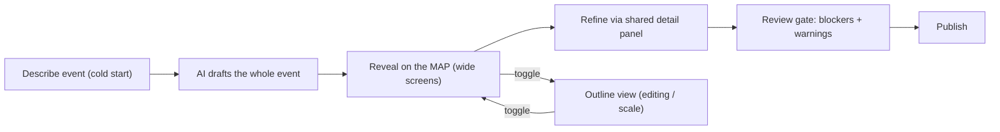

# AI Event Creation — Product Brief

_Status: foundation brief. Read this first; it sets the "why" and the bet. For the surface-layer history and rationale, see [event-creation-direction-decision.md](event-creation-direction-decision.md)._

## TL;DR

Today at Highspot, an admin **creates an empty event first, lands in Event Overview, then hand-builds each session one at a time.** That order is the tax. The bet: let the admin **describe the event once in plain words**, have AI **draft the whole event and all its sessions together**, reveal it on a **node map**, then refine and publish. Draft-first is the primary path; manual is the fallback.

In one line: **describe once, AI drafts event + sessions together, refine, publish.**

## Who this is for

The Highspot **event admin** — a program or content owner, not a developer. They range from occasional (one webinar) to power users (a multi-week onboarding or certification program). The flow has to be effortless for the simple case and scale to the multi-session tail.

## Job to be done

> When I need to run an event, I want to define it and its sessions correctly and publish fast — and change it later without redoing everything — so I spend my time on the event, not the tool.

## Current state (manual) and its pain

Events are created manually, and the order is fixed: **event first, then sessions.**

1. Create an empty event.
2. Land in Event Overview.
3. Add a session, configure its details.
4. Repeat per session.
5. Publish.

The structure is born piecemeal and sequentially. It is slow for a simple event and brutal for a multi-session program, where the admin repeats the same setup loop over and over and has no whole-picture view until the end.

## The AI bet

AI does not just speed up the manual steps — it **inverts the order.** The admin describes intent once ("three-part virtual onboarding for new hires, weekly Tuesdays at 10am, led by Priya Rao") and AI generates the event and all of its sessions as one coherent draft. Event and sessions are **born together**, not event-first-then-sessions.

- **Interaction bet:** draft-first generative. Describe -> AI drafts the whole event -> admin refines -> publish.
- **Placement:** primary path. AI becomes the default way to create an event; manual create is the clear fallback.
- **Surface (map-forward blend):** the AI result reveals on a **node map** — the whole event shape at a glance, which is the demo wow and dramatizes "the AI built this." The **outline** is a co-equal, one-click surface for editing and scale, and **both feed the same node detail panel.** The map is the default reveal on wide screens; narrow screens fall back to the outline, which the toggle always reaches. The underlying model is a hierarchy (event -> sessions -> details); the map visualizes that hierarchy without pretending sessions route to each other. (See the direction decision doc.)

## Target flow

## Hero scenario

Lead with a **small event (1-3 sessions)**: it keeps the map clean and readable while still landing the generative reveal. This is the demo-plus-usable sweet spot — the map's crowding problem only appears at 10+ sessions, which the hero never reaches. The outline remains the surface for anyone scaling to a larger program.

## Success metrics

- **Time-to-first-publish** for a single-session event (down).
- **% of events published without a later edit** (up — proxy for "got it right the first time").
- **Multi-session completion rate** — events with 3+ sessions that reach publish (up).
- **Publish-time blockers** hit at review (down over time).
- **Support tickets / confusion** related to event creation (down).

## Non-goals

- No real LLM in this prototype — "generation" is a deterministic parser that builds the same node draft the manual paths build.
- Not a production app, data layer, or design system. This is a visual and interaction prototype aligned to `design.md`.
