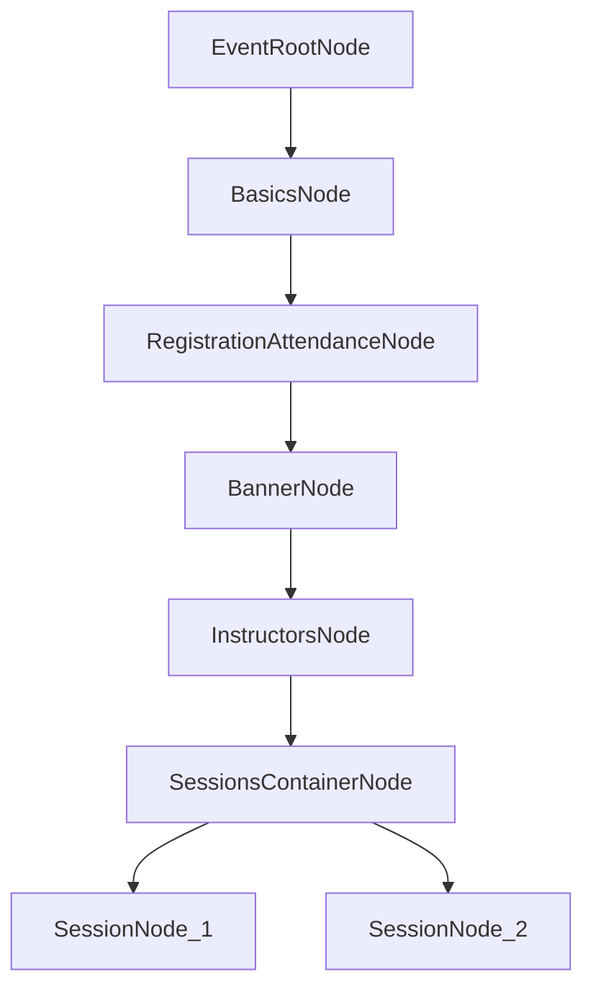

# Node-Based Event Admin Flow (Phase 1)

## Goal
Turn the current "New Event" modal into a node-driven creation flow where an `Event` is the root container and multiple `Session` branches can be attached later, while keeping the current fields intact.

## Scope (This phase)
- Convert the current modal into a graph-backed flow for **Event-level metadata**.
- Establish a **Session container node** so each Event can hold multiple Sessions.
- Add rich interactions for node navigation, completion state, validation hints, and draft persistence (prototype-level).

## Node Model
Use a directed graph with a single required root:

- `EventRootNode` (required)
- `BasicsNode` (Title, Description, Spot)
- `RegistrationAttendanceNode` (registration/enrollment rules)
- `BannerNode` (banner upload)
- `InstructorsNode` (multiple names/emails)
- `SessionsContainerNode` (holds one or more Session branches)

### Session branch scaffold (foundation only in Phase 1)
- `SessionNode` (repeatable child under SessionsContainer)
- Future session children (next phase): schedule, capacity, venue, instructors, materials, publish checks

## Suggested Graph (Admin flow)

## UX Behavior
- Left rail (or top strip) shows node list with status: `Not started`, `In progress`, `Complete`, `Needs attention`.
- Main pane renders the currently selected node form.
- "Continue" moves to the next required node; users can jump between completed nodes.
- "Add session" creates a new `SessionNode` entry under the session container.
- Unsaved changes and missing required fields are shown per-node before publish/finish.

## Validation Rules (Phase 1)
- `Title`: required, non-empty.
- `Description`: optional (with recommended max length hint).
- `Spot`: required selection.
- `RegistrationAttendance`: required to choose at least one mode/rule path.
- `Banner`: optional file with type/size hints.
- `Instructors`: allow list entries by name or email; validate email format when email-like.
- `SessionsContainer`: minimum one session required before final completion (can be added as warning if you want soft enforcement now).

## Data Shape (prototype)
Represent draft as graph + per-node payload:
- `eventDraft.id`
- `eventDraft.nodes[]` (node metadata, status, order, parent)
- `eventDraft.edges[]` (directed links)
- `eventDraft.payloadByNodeId` (form values)
- `eventDraft.meta` (lastSavedAt, createdBy, validationSummary)

## Interaction States to Prototype
- Node selection and keyboard traversal.
- Add/remove/reorder session nodes under session container.
- Per-node inline validation + global completion indicator.
- Save draft locally and restore on reopen.
- Confirm-before-exit if dirty.

## Implementation Sequence
1. Introduce graph schema/types and seed default Event graph on "New Event".
2. Map existing modal fields into their respective node forms.
3. Build node navigator UI and status chips.
4. Add session container behavior (`Add Session`, list of session nodes).
5. Add validation + completion gates.
6. Add draft save/restore and exit guard.
7. Add realistic sample data for Event Admin demos.

## Out of Scope (next phase)
- Deep Session authoring details per session.
- Cross-session conflict detection.
- AI-assisted field suggestions.
- Publish pipeline and role-based approvals.

## Deliverables from this phase
- A node-based Event creation shell for admins.
- Event-level fields fully migrated into nodes.
- Multi-session foundation in place for phase-2 Session authoring.

## Phase 1 to Phase 2 Handoff Checklist
- Confirm `EventRootNode`, Event-level child nodes, and `SessionsContainerNode` contracts are stable.
- Confirm each node status (`Not started`, `In progress`, `Complete`, `Needs attention`) is computed consistently.
- Confirm validation output format is shared and reusable for session-level checks in Phase 2.
- Confirm draft payload supports repeatable `SessionNode` references without breaking restore behavior.
- Confirm interaction patterns (node switching, continue behavior, dirty-state prompts) are finalized for reuse.
- Confirm demo fixtures include at least one event with multiple session placeholders for Phase 2 seeding.
