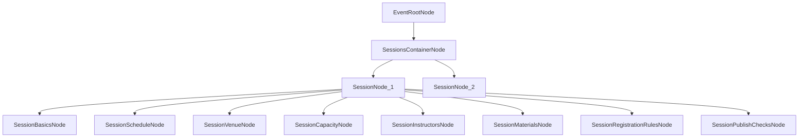

# Node-Based Event Admin Flow (Phase 2 Companion)

## Goal
Extend Phase 1 from Event-level setup into full Session authoring, validation, and publish readiness for Event Admins managing multi-session events.

## Scope (This phase)
- Define complete `SessionNode` architecture and child nodes.
- Support many sessions per event with ordering and cloning.
- Add cross-session conflict detection and readiness checks.
- Add pre-publish review with actionable errors.

## Session Node Architecture
Each `SessionNode` acts as a branch with required children:

- `SessionBasicsNode` (session title, summary, track/type)
- `SessionScheduleNode` (date, start/end time, timezone)
- `SessionVenueNode` (virtual link or physical location)
- `SessionCapacityNode` (seat limit, waitlist behavior)
- `SessionInstructorsNode` (one or more instructors)
- `SessionMaterialsNode` (optional attachments/resources)
- `SessionRegistrationRulesNode` (session-specific overrides)
- `SessionPublishChecksNode` (computed validation status)

## Expanded Graph

## Event Admin UX (Phase 2)
- Session rail inside `SessionsContainerNode` with add, duplicate, delete, and reorder.
- Session cards show compact metadata (time, venue type, capacity, status).
- "Jump to incomplete" action moves admin to highest-priority missing node.
- Session template presets (optional) for recurring event formats.
- Sticky validation summary for all sessions while editing.

## Validation and Rules
### Session-level
- Session title is required.
- Start/end must be valid and end must be after start.
- Timezone is required.
- At least one venue mode must be defined.
- At least one instructor is required (name or valid email).

### Cross-session
- No instructor double-booking in overlapping time windows.
- No venue collision when venue IDs match and times overlap.
- Optional warning for duplicate session titles.
- Optional warning for large schedule gaps or overlaps inside an event.

## Draft and State Model Updates
Extend Phase 1 draft shape:
- `eventDraft.sessions[]` for quick ordered index.
- `eventDraft.sessionMap[sessionId]` for branch payload access.
- `eventDraft.conflicts[]` for derived overlap/collision warnings.
- `eventDraft.publishChecklist` for event-wide readiness gates.

## Admin Actions to Add
- `AddSession`
- `DuplicateSession`
- `RemoveSession`
- `ReorderSession`
- `ValidateSession`
- `ValidateEvent`
- `PublishEvent` (enabled only when checks pass or warnings are acknowledged)

## Publish Readiness Flow
1. Admin triggers review.
2. System computes per-session and cross-session checks.
3. Blocking errors grouped by session.
4. Warnings grouped separately with optional override note.
5. Publish enabled only after blockers are cleared.

## Implementation Sequence
1. Define `SessionNode` child schema and status engine.
2. Build session rail UI and CRUD interactions.
3. Add session form panels for all required child nodes.
4. Add derived conflict engine (instructor/venue/time overlaps).
5. Add event-wide validation summary and publish checklist.
6. Add duplicate-session and reorder utilities.
7. Add realistic multi-session demo fixtures.

## Out of Scope (Phase 3 candidates)
- AI-assisted schedule and instructor suggestions.
- External calendar sync.
- Role-based approval workflow.
- Audit trail/version history.

## Deliverables
- Complete node-based multi-session authoring flow.
- Cross-session conflict visibility for Event Admins.
- Publish-ready review gate with clear blocking and warning states.

## Phase 1 Dependency Checklist
- Inherit Phase 1 graph primitives without redefining root-level node contracts.
- Reuse existing draft save/restore mechanics before extending session branch payloads.
- Reuse Phase 1 validation messaging style for consistency across Event and Session nodes.
- Reuse node navigation affordances (status chips, jump behavior, incomplete highlighting).
- Validate backwards compatibility with Phase 1 drafts that contain session placeholders only.
- Confirm migration path from placeholder sessions to fully authored session branches is deterministic.
