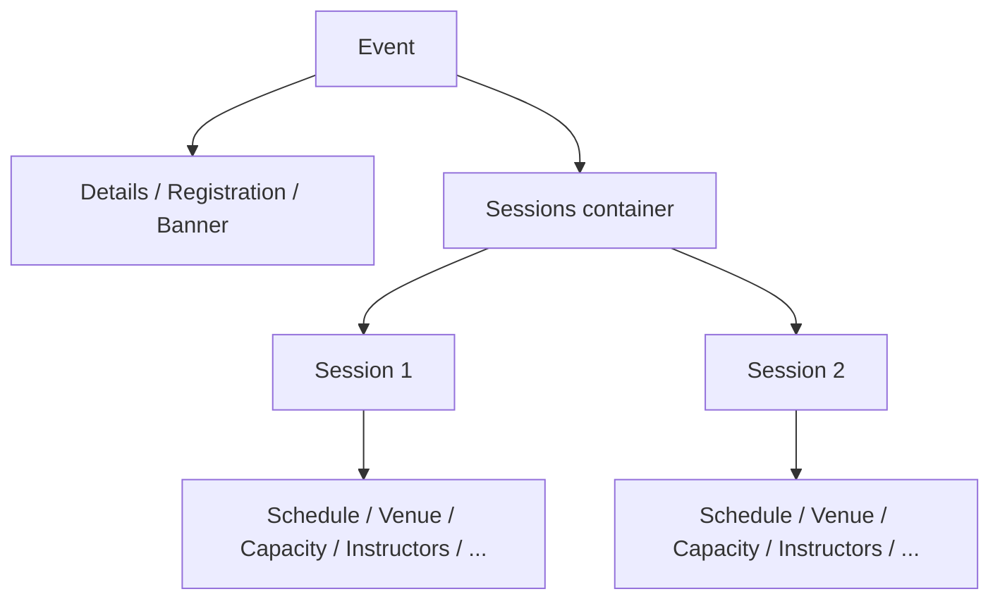

# Event Creation Direction — Decision Doc

_Status: draft for review. Anchor for the follow-up design discussion._

## TL;DR

We built a **fully node-based canvas** for event creation and are now unsure it's the right direction. After pressure-testing it against the current wizard, the recommendation is a **hybrid**:

> Keep the **node data model + status/validation engine + publish-review gate** we already built. Keep the fast **cold-start quick form**. **Drop the free-form spatial canvas** (zoom / pan / fit / "branch points" / "paths") and replace it with an always-visible **structured outline (tree) + detail panel**.

In one line: **node-based model, structured layout — not a free-form canvas.**

The core reason: the event domain is a **container hierarchy**, not a graph with real decision-branches. The canvas pays a spatial-UI tax for branching semantics the domain doesn't have. Almost everything valuable in the prototype lives in the model and validation layers, which we keep; only the presentation layer changes.

## The problem

Event admins need to stand up an event and its sessions, get it correct (nothing missing, no conflicts), publish it, and **edit it later** — all quickly. Two facts shape the design:

- **Complexity is lopsided.** Most events are simple (one session). A minority are large multi-session programs. A good flow has to be effortless for the common case _and_ scale to the tail.
- **The structure is a hierarchy, not a graph.** An event contains parts (details, registration, banner) and a set of sessions; each session contains detail items (schedule, venue, capacity, instructors, materials, registration rules).

The admin fills in a tree. They never route between branches. That single observation is what makes "fully node-based canvas" the wrong _surface_, even though the node _model_ underneath is sound.

### Job-to-be-done

> When I need to run an event, I want to define it and its sessions correctly and publish it fast — and come back to change things later without redoing everything — so I can spend my time on the event, not the tool.

## Options considered

Evaluated against shared criteria: **speed for the common case, correctness / guardrails, editability after creation, learning curve, scale to many sessions, accessibility / responsive, build + maintenance cost, differentiation.**

### Option A — Current wizard (status quo)

Three linear steps (Event Details -> Sessions -> Configuration) with a sub-modal to configure each session.

- **Strengths:** familiar, guided, low cognitive load; required steps enforce a baseline of correctness; fast for a single simple event; cheap to maintain.
- **Weaknesses:** strictly linear; **modal-in-modal** per session is click-heavy; **no whole-picture view**; painful to revisit and edit after creation; doesn't scale as session count grows; validation only surfaces at step boundaries, not continuously.

### Option B — Full node-based canvas (the built prototype)

A pannable canvas of connected nodes: event-level nodes plus a Sessions "branch point" with Session "branches" and their detail children, with zoom / fit, per-node status chips, and a publish-review gate.

- **Strengths:** whole structure visible at a glance; **jump-anywhere / non-linear editing**; continuous per-node validation; strong pre-publish review (blockers + warnings); extensible; visually differentiated.
- **Weaknesses:** **spatial overhead with no payoff** — the domain doesn't branch, so zoom / pan / fit / connectors are ceremony, not utility; steeper learning curve for occasional admins; harder to make accessible and to fit small / narrow screens; higher build and maintenance cost; the "branch point / path" metaphor **overstates** the domain and risks feeling like a developer tool for a content-admin audience.

### Option C — Hybrid: structured outline + node model (recommended)

Cold-start quick form to seed the common case in seconds, then an **always-visible structured outline (tree)** of the event on the left and a **detail form panel** on the right (list-detail), carrying over the prototype's continuous status chips and publish-review gate. Optionally keep the canvas as an **opt-in, read-only overview**.

- **Strengths:** delivers the node-model benefits — see the whole structure, jump anywhere, continuous validation, non-linear editing — **without** the spatial cost; scales cleanly from 1 to N sessions (a tree of many items is normal; a canvas of many nodes is not); better accessibility and responsive behavior; lower learning curve than a canvas; **reuses most of the existing engine**; matches the domain's true hierarchy.
- **Weaknesses:** less visually "wow" than a canvas; loses free-form spatial arrangement (which the domain doesn't need); still more novel than a plain wizard, so it needs light onboarding affordances.

## Why C over B

**The node _model_ is right; the canvas _UI_ is the mismatch.** A directed graph is a fine internal representation, but rendering it as a free-form spatial canvas exposes affordances (arbitrary placement, zoom, pan, connectors between "branches") that map to nothing an admin decides. An outline presents the exact same model as the shape it actually is — nested containers — which is easier to learn, faster to scan, and far friendlier on narrow screens.

**It's reuse, not rebuild.** The presentation layer is the only part that changes:

- **Carries over unchanged (the valuable core):** the node schema and `NODE_TYPES`, session child-node structure, the per-node status/completion engine, cross-session conflict checks (instructor / venue / time overlaps), and the publish blockers / warnings review gate. This is the bulk of `event-admin.js` and both `docs/event-admin-node-flow-phase-1.md` and `docs/event-admin-node-flow-phase-2.md`.
- **Changes:** swap the canvas renderer (`event-node-canvas`, zoom / fit / connector layout) for an outline/tree renderer; the node detail form panel stays largely as-is.
- **Keep as-is:** the cold-start quick form (`event-cold-start`) — it's already the right answer for the common case.

## Success metrics

- **Time-to-first-publish** for a single-session event (down).
- **% of events published without a post-publish edit** (up — proxy for "got it right the first time").
- **Publish-time error rate** — blockers hit at review (down over time).
- **Multi-session completion rate** — events with 3+ sessions that reach publish (up).
- **Usability task-success** in moderated testing for "create and publish a 3-session event" (up), with lower time-on-task than both the wizard and the canvas.
- **Support tickets / confusion** related to event creation (down).

## Risks & mitigations

- **"We're throwing away the canvas we built."** We aren't — we keep the model, validation, and review engine (most of the work) and can retain the canvas as an optional read-only overview. Mitigation: frame this as a presentation swap, not a restart.
- **Outline feels less impressive in demos.** Mitigation: lean on the cold-start quick form (fast "wow"), live status, and the publish-review gate for demo moments; optionally show the graph overview as a flourish.
- **Novelty vs. the familiar wizard.** Mitigation: keep steps implicit via the outline order and continuous validation; add light first-run guidance.

## Open questions (for the design discussion)

- How much does visual differentiation / "wow" matter here versus raw speed and clarity for admins?
- Is the opt-in **read-only graph overview** worth keeping, or is it maintenance we don't need?
- Do we want a **single-session express path** (quick form -> publish) that skips the outline entirely for the simplest case?
- Where should this live relative to today's wizard — full replacement, or a switchable "advanced" mode during rollout?
