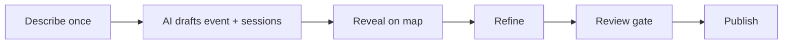

# Refining the event creation flow

## The diagnosis

The flow doesn't fail on polish. It fails because the demo's best moment comes from a scripted shortcut (`#draft-program-button` replaying a canned transcript) rather than from the product mechanic, and because the "refine" beat in the brief's own target flow exists in code but is unreachable.

Intended flow per [docs/ai-event-creation-brief.md](docs/ai-event-creation-brief.md):

What is actually wired: `describe` has three inconsistent entrances, `refine` is dead code, and `reveal` is reachable mainly via a scripted button.

---

## Phase 1 — Make the bet the actual path

### 1a. Make "Create with AI" do something

`chat.js:2550-2557` currently closes the switcher and focuses the composer. Replace with: switch to chat view, reset the chat, set an event-flavored placeholder, and render example prompt chips above the composer. Reuse the three chip strings already written for the cold start at `event-editor-shell.js:23-25` so both surfaces teach the same prompts.

### 1b. Unify on reveal-first, retire the proposal gate

Two describe boxes lead to two journeys today:

- Cold start (`event-editor-shell.js:11-32`): describe, then `#event-proposal` review, then build.
- Chat (`chat.js:2063-2098`, `2271`): describe, then straight to the map reveal.

The brief says reveal first, refine after. So make the chat behavior canonical: the cold start's **Generate event** (`event-admin.js:4052-4071`) should reveal on the map directly, and `#event-proposal` (`event-editor-shell.js:109-116`) is retired as a pre-build gate. Its editing value is replaced by 1c, which happens in the right place.

### 1c. Wire the refine card that already exists

This is the core change. After the map reveal, append the editable structure card instead of jumping straight to `offerEnterpriseSetup()`:

- `buildMethodologySessionsMessage()` — [chat.js:179-198](chat.js)
- editable structure renderer with add/remove session rows — [chat.js:331-573](chat.js)
- `readStructureEdits` + "Build this on the canvas" handler — [chat.js:1224-1239](chat.js)

Trigger it from `buildGeneratedEventResponse` (`chat.js:2063-2098`) and from the `methodology-rollout` transcript (`chat.js:54-79`) so both the typed path and the scripted path get the same refine beat. Change the card's action label from "Build this on the canvas" to an apply-edits label, since the canvas already exists at that point.

### 1d. Kill the lorem fallback

`chat.js:1141` and `chat.js:1157-1160` return Latin placeholder copy for any unmatched prompt. Replace with an in-character capability reply naming what the assistant can do (draft an event, shift dates, swap or rename sessions, set capacity, change venue mode), mirroring the good `unknown-edit` copy already at `chat.js:2257-2259`. Also tighten `looksLikeEventPrompt` (`chat.js:2056-2057`) — matching bare `create` and `schedule` misroutes ordinary questions into the event generator.

### 1e. Make the demo restartable

- `#new-chat-button` (`chat.js:2471-2479`) should call `closeEventWorkspace()` so a new chat returns to the home workspace.
- `resetCurrentDraft()` (`event-admin.js:3943-3950`) currently leaves you sitting in the event workspace on a cold start; it should exit to the home workspace.
- Clear the `localStorage` draft (`event-admin.js:4`, `604-609`) on reset, so a reload doesn't restore a stale event into "Finish setup".

---

## Phase 2 — Make the workspace read as a product, not a tool

### 2a. Rebuild the canvas toolbar

`event-editor-shell.js:128-139` has eight controls in one strip. Target state:

- Auto-fit the graph on build; drop `Fit graph` and `Reset view` from the default toolbar.
- Show the zoom cluster only when the graph actually overflows its frame (the 1-3 session hero never will).
- Turn `#event-view-toggle` from a single toggle button into a real segmented control, reusing the existing `.event-toolbar-toggle` pattern already in [index.html:257-260](index.html).
- Move `Draft saved locally.` (`#event-admin-meta`) out of the toolbar into a quiet status next to the header actions.

### 2b. Fix the header action hierarchy

[index.html:230-235](index.html) renders Reset / Save / Review / Publish as four near-identical `home-task-action` buttons with a destructive action leading. Target: Reset moves into an overflow menu, Save becomes a quiet control paired with the save-state text, Review and Publish become the visible pair with Publish primary.

### 2c. Resolve View Event mode

`setEventOverviewMode` (`chat.js:1937-1956`) plus `styles.css:2946-2948` make "View Event" hide the tab bar and change nothing else. Either render an actual attendee-facing view (cover, dates, sessions, register CTA, no admin chrome) or remove the toggle. Recommendation: render it — the admin/attendee contrast is a strong demo moment and the data is already in `getEventContext()`.

### 2d. Deal with the preview-only controls

`title="Preview only in this prototype"` appears on the overview home/help/more icons ([index.html:248-265](index.html)) and four of five overview tabs (`chat.js:1805-1806`). Give them one deliberate disabled treatment instead of a tooltip, or remove them.

---

## Phase 3 — Craft pass

- Canvas vertical dead space at default zoom, and `#event-admin-main-panel` clipping at narrower panel widths (both visible in `shots/overview-diag.png`).
- `#event-admin-progress-chip` competing with the `#event-canvas-heading` for the same visual slot.
- Empty/loading states for the map during generate.

All styling follows the tokens in [design.md](design.md); motion uses the existing Polar Motion tokens in `:root` rather than new hardcoded durations.

---

## Verification

There is a Playwright harness in `verify-tmp/` (`verify-chat-first.mjs`, `verify-ai-outline.mjs`, `verify-overview-redesign.mjs`, `shots.mjs`). Each phase ends with a screenshot pass over the full path: Create with AI, describe, reveal, refine card, publish review, overview, back, reset — checking panel resize and the narrow-screen outline fallback (<= 760px) still behave.